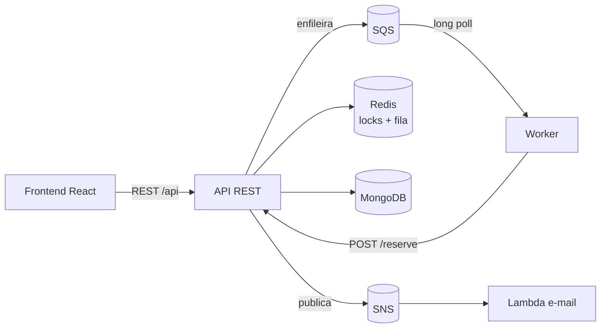
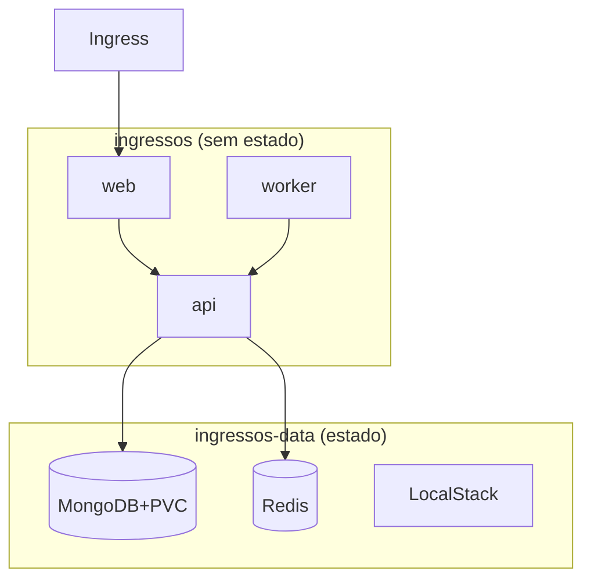

# Roteiro de Apresentação — Plataforma Distribuída de Venda de Ingressos

> Slides em Markdown. Cada bloco separado por `---` é um slide. Tempo-alvo: ~12–15 min
> + demo ao vivo. Sugestão de divisão de falas entre os integrantes ao final.

---

## Slide 1 — Capa

**Plataforma Distribuída de Venda de Ingressos**
Absorvendo picos de acesso com fila virtual, exclusão mútua distribuída e
processamento desacoplado

Disciplina de Sistemas Distribuídos — Trabalho semestral
Integrantes: _____________________

---

## Slide 2 — A problemática

- Venda de ingressos para eventos populares → **pico súbito** na abertura das vendas.
- Milhares de usuários disputando **assentos finitos** ao mesmo tempo.
- Três desafios distribuídos simultâneos:
  1. **Não vender o mesmo assento duas vezes** (exclusão mútua).
  2. **Não cair** sob a carga (disponibilidade).
  3. **Dar feedback** ao usuário durante a espera.

> "Escalar o banco" é caro e tem limite. A saída é **desacoplar** receber de processar.

---

## Slide 3 — A ideia central (em uma frase)

> **Trocar indisponibilidade por latência de processamento.**

Em vez de o usuário bater direto no banco e receber erro, ele **entra numa fila**,
recebe uma **posição**, e é atendido num **ritmo sustentável**.

---

## Slide 4 — Solução em 4 peças

1. **Fila virtual (SQS):** a compra entra numa fila; o usuário recebe uma posição.
   *Workers* consomem em ritmo controlado → **backpressure**.
2. **Reserva temporária (Redis + TTL):** o assento é travado com `SET NX EX 300`.
   Sem pagamento, o lock **expira sozinho** → exclusão mútua sem deadlock.
3. **Confirmação assíncrona (SNS + Lambda + SES):** pagamento publica no SNS;
   a Lambda envia o e-mail. Falha de e-mail **não derruba** a compra.
4. **Persistência (MongoDB):** eventos, assentos, pedidos.

---

## Slide 5 — Arquitetura (visão de componentes)



**Decisão-chave:** o *worker* **não** fala com o Mongo — delega a reserva à API
(fonte única de verdade). O *worker* só faz **uma coisa**: drenar a fila no ritmo certo.

---

## Slide 6 — Fluxo do caminho feliz

1. Escolhe assento → `POST /purchase` → **202 + posição na fila**
2. Frontend faz *polling* da posição (`GET /queue/:id`)
3. Worker consome a fila → API tenta o **lock no Redis**
   - Obteve → `reserved` (5 min)
   - Falhou → `failed` (assento tomado)
4. Paga dentro do TTL → pedido `paid`, assento `sold`
5. API **publica no SNS** → Lambda envia **e-mail**
6. TTL expira sem pagamento → assento **volta a ficar livre** sozinho

---

## Slide 7 — Exclusão mútua distribuída (o coração)

```
SET lock:seat:{id} {token} EX 300 NX
```

- **`NX`** → só **um** processo adquire o lock (atomicidade = exclusão mútua).
- **`EX 300`** → reserva temporária; expira sozinha (sem deadlock, sem job de limpeza).
- **Liberação** via *script Lua* (compare-and-delete): só o dono do `token` libera.

Funciona com **N instâncias** de API/worker → exclusão mútua **distribuída**, não local.

---

## Slide 8 — Componentes obrigatórios ✓

| Requisito | Como atendemos |
|---|---|
| Cluster Kubernetes | k3s sobre EC2 (AWS Academy) |
| Lambda | E-mail de confirmação |
| SQS | Fila virtual de compra |
| SNS | Evento "pedido confirmado" → Lambda |
| Banco distribuído | Redis (locks/TTL) + MongoDB (dados) |
| Front + back | SPA React + API REST |
| Observabilidade | Prometheus + Grafana / CloudWatch |
| Isolamento | Namespaces no K8s + filas |

---

## Slide 9 — Kubernetes: isolamento por namespaces



- Entrada **única** pelo Ingress (backend não exposto).
- Estado isolado do que é descartável. Mesmos manifests: local **e** nuvem.

---

## Slide 10 — Observabilidade

- API e worker expõem `/metrics` (Prometheus via `prom-client`).
- Métricas de domínio que contam a história:
  - **`queue_depth`** → a fila enchendo e drenando (prova do backpressure)
  - `reservations_total` / `payments_total` → sucesso vs. conflito
  - latência HTTP por rota
- **Grafana** sobe com dashboard **já provisionado** (zero clique na demo).

---

## Slide 11 — Teste de carga (a prova)

Pico de **~30 req/s por 15s** com k6 batendo na fila:

| Métrica | Valor |
|---|---|
| Compras enfileiradas | **463** |
| HTTP 202 | **100%** |
| Erros | **0** |
| p95 | **≈ 17 ms** |
| Pico de `queue_depth` | **418** → drenado a ~2/s |

> **Ninguém recebeu erro.** Todos entraram na fila e foram atendidos no ritmo do worker.

---

## Slide 12 — Demonstração ao vivo

1. Subir a stack: `docker compose up -d` + `deploy-lambda`.
2. Comprar um ingresso pelo frontend (evento → assento → fila → checkout → confirmação).
3. Mostrar o e-mail em `http://localhost:4566/_aws/ses`.
4. Disparar o teste de carga e ver a **`queue_depth`** subir e drenar no **Grafana**.
5. (Se houver Learner Lab ativo) mostrar os recursos reais na AWS.

---

## Slide 13 — Conclusão

- **Desacoplamento** = resiliência (e-mail cai, compra não).
- Uma **primitiva atômica simples** (`SET NX EX`) resolve exclusão mútua e deadlock.
- Tratar **disponibilidade** e **correção** como problemas separados.
- **Trabalhos futuros:** escalar workers, DLQ, pagamento real idempotente, HPA,
  FIFO estrito, CloudWatch.

**Obrigado!** Perguntas?

---

## Divisão de falas (sugestão)

| Bloco | Slides | Responsável |
|---|---|---|
| Problemática + ideia central | 2–4 | __________ |
| Arquitetura + fluxo | 5–7 | __________ |
| Componentes + K8s | 8–9 | __________ |
| Observabilidade + carga | 10–11 | __________ |
| Demo ao vivo | 12 | __________ |
| Conclusão + perguntas | 13 | todos |
