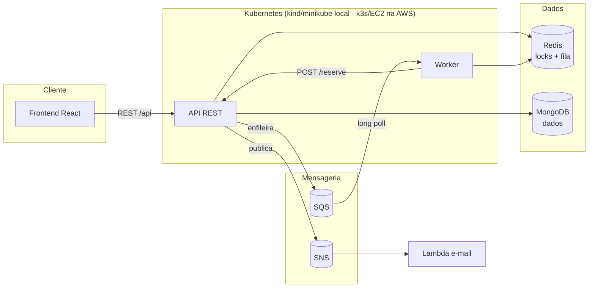
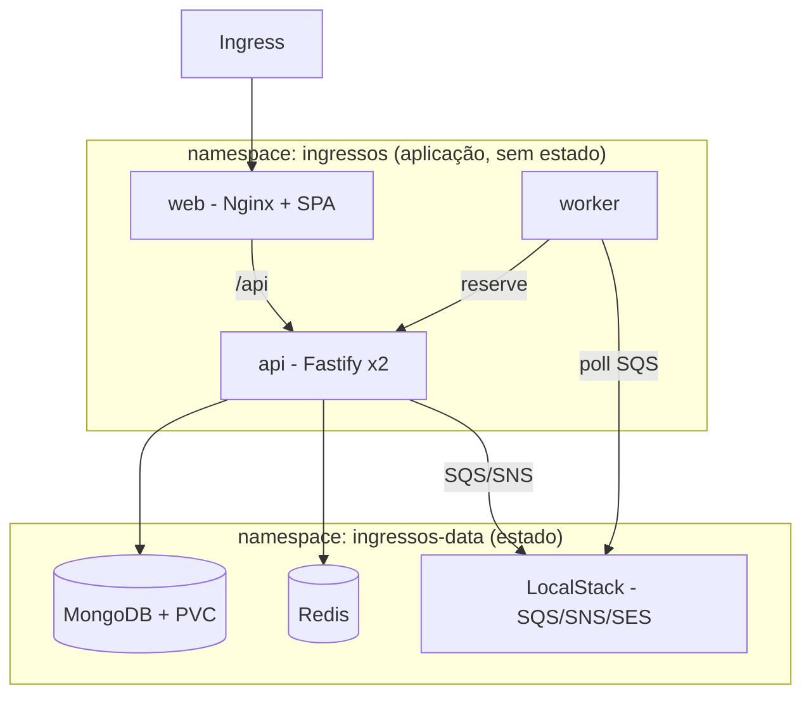
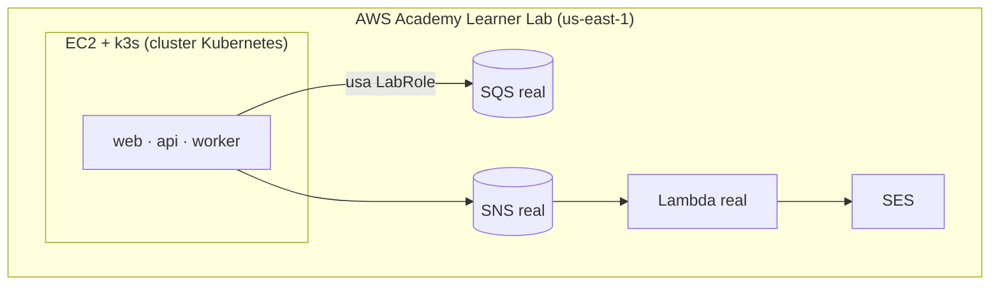
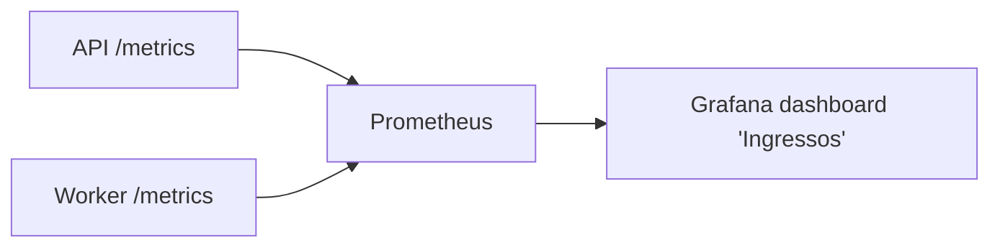

# Plataforma Distribuída de Venda de Ingressos: absorvendo picos de acesso com fila virtual, exclusão mútua distribuída e processamento desacoplado

**Disciplina:** Sistemas Distribuídos
**Trabalho semestral** — Aplicação completa sobre infraestrutura distribuída na AWS

---

## Resumo

A venda de ingressos para eventos populares é um caso clássico de sistema sujeito a
**picos súbitos de carga**: no instante da abertura das vendas, milhares de usuários
disputam simultaneamente um número finito de assentos. Esse cenário expõe três
desafios típicos de sistemas distribuídos: (i) garantir **exclusão mútua** para que o
mesmo assento nunca seja vendido duas vezes; (ii) **absorver a carga** sem derrubar o
sistema; e (iii) **dar feedback** ao usuário durante a espera. Este trabalho apresenta
o projeto e a implementação de uma plataforma de venda de ingressos que ataca esses
três problemas combinando uma **fila virtual** (AWS SQS) para amortecimento de carga
(*backpressure*), **reserva temporária de assento** via locks com expiração automática
(Redis com TTL) para exclusão mútua distribuída, e **confirmação assíncrona por e-mail**
desacoplada do fluxo de compra (AWS SNS + AWS Lambda + SES). A persistência de dados de
domínio usa **MongoDB**, e toda a aplicação (API REST, *workers* e *frontend*) é
orquestrada em um **cluster Kubernetes**. O sistema foi validado de ponta a ponta em
ambiente local (Docker Compose + LocalStack) e a infraestrutura de nuvem foi
projetada para o **AWS Academy Learner Lab** com *cluster* k3s sobre EC2. Um teste de
carga com k6 simulando a abertura de vendas demonstrou empiricamente a tese central:
sob um pico de ~30 requisições/s, **463 compras foram enfileiradas com 100% de
respostas HTTP 202 e zero erros**, com a profundidade da fila chegando a 418 itens e
sendo drenada de forma estável. O sistema **troca indisponibilidade por latência de
processamento** — ninguém recebe erro; todos entram na fila e são atendidos em um
ritmo sustentável.

**Palavras-chave:** sistemas distribuídos; exclusão mútua; mensageria; *backpressure*;
Kubernetes; serverless; observabilidade.

---

## 1. Introdução e problemática

Plataformas de venda de ingressos para eventos de grande apelo (shows, jogos,
festivais) operam, na maior parte do tempo, sob carga moderada. Contudo, no momento
da **abertura das vendas**, sofrem um pico de acesso de ordens de magnitude superior à
média: um grande número de usuários chega praticamente ao mesmo tempo, todos
competindo pelos mesmos recursos escassos — os assentos.

Esse comportamento caracteriza um problema clássico de sistemas distribuídos sob alta
contenção, com três exigências simultâneas:

1. **Correção (exclusão mútua):** um assento é um recurso de uso exclusivo. Sob
   concorrência massiva, é inaceitável vender o mesmo assento a dois compradores
   (*double selling*). A garantia de exclusão mútua precisa funcionar mesmo havendo
   **múltiplas instâncias** do serviço processando compras em paralelo — ou seja,
   exclusão mútua *distribuída*, e não apenas um *lock* em memória local.

2. **Disponibilidade sob carga:** se cada requisição de compra bate diretamente no
   banco de dados, o pico satura a camada de persistência e o sistema inteiro
   degrada ou cai — justamente no momento de maior valor de negócio. É preciso
   **amortecer** o pico, processando as compras em um ritmo que a infraestrutura
   suporte.

3. **Experiência do usuário:** durante a espera, o usuário não pode ficar diante de
   uma tela travada ou de um erro genérico. É necessário dar **feedback** — por
   exemplo, a posição em uma fila — para que a espera seja compreensível e o sistema
   pareça responsivo mesmo sob estresse.

A solução tradicional de "escalar o banco" é cara e tem limites. Este trabalho adota a
abordagem, consagrada em arquiteturas de internet de larga escala, de **desacoplar** a
recepção da requisição do seu processamento por meio de uma **fila**, combinada a um
mecanismo de **reserva temporária** que resolve a exclusão mútua sem manter transações
longas no banco. O restante deste artigo detalha a fundamentação, a arquitetura, as
tecnologias escolhidas, a implementação por componente, a observabilidade e os
resultados do teste de carga.

---

## 2. Fundamentação teórica

### 2.1 Exclusão mútua distribuída

Exclusão mútua é a garantia de que, em qualquer instante, **no máximo um** processo
detém acesso a uma seção crítica — aqui, o direito de reservar um assento específico.
Em um sistema com um único processo, isso se resolve com primitivas locais (*mutex*,
*semaphore*). Em um sistema **distribuído**, com várias instâncias de *workers* e de
API rodando em pods distintos, é preciso um árbitro externo compartilhado.

Neste projeto, o árbitro é o **Redis**, usando a operação atômica `SET chave valor NX EX`:

- **`NX` (set if Not eXists)** garante atomicidade: apenas o **primeiro** processo a
  executar a operação cria a chave e adquire o *lock*; todos os demais falham. Essa é a
  primitiva de exclusão mútua.
- **`EX` (expiração em segundos)** transforma o *lock* em uma **reserva temporária com
  TTL** (*Time To Live*). Se o detentor do *lock* falhar ou desistir, o *lock* expira
  sozinho, liberando o recurso — eliminando o risco de *deadlock* por travamento órfão,
  sem precisar de um processo de limpeza (*garbage collector*).

A **liberação segura** do *lock* usa o padrão *compare-and-delete* via *script* Lua
(executado atomicamente pelo Redis): só apaga o *lock* quem provar ser seu dono,
comparando um *token* único gravado no momento da aquisição. Isso evita que um processo
libere por engano um *lock* que já foi readquirido por outro após a expiração.

### 2.2 Desacoplamento e mensageria (filas e pub/sub)

**Desacoplamento** é o princípio de fazer componentes se comunicarem de forma
**assíncrona**, sem dependência temporal direta. Dois padrões de mensageria são usados:

- **Fila (ponto a ponto) — AWS SQS:** o produtor (API) deposita mensagens; um ou mais
  consumidores (*workers*) as retiram. A fila funciona como um **amortecedor**
  (*buffer*): se a produção (pico de compras) supera o consumo, as mensagens se
  acumulam na fila em vez de sobrecarregar o consumidor. Esse mecanismo de
  **controle de fluxo / *backpressure*** é o coração da estratégia anti-pico.

- **Publicação/assinatura (pub/sub) — AWS SNS:** o produtor publica um evento em um
  **tópico**; *N* assinantes reagem independentemente. Usamos SNS para emitir o evento
  "pedido confirmado" após o pagamento. O envio de e-mail é apenas **um** assinante —
  e o fato de o e-mail falhar ou demorar **não afeta** a confirmação da compra.

### 2.3 *Backpressure* (contrapressão / amortecimento de carga)

*Backpressure* é a técnica de **limitar o ritmo** com que um sistema aceita ou processa
trabalho, mantendo-o dentro da capacidade sustentável. Aqui, os *workers* consomem a
fila a uma taxa controlada (parâmetro `WORKER_RATE_MS`). Sob um pico, as compras se
acumulam na SQS e são drenadas de forma estável — o sistema **converte um pico de
disponibilidade em latência de processamento** distribuída no tempo, em vez de
converter o pico em erros e indisponibilidade.

### 2.4 Computação *serverless* e orquestração de contêineres

- **Serverless (AWS Lambda):** funções efêmeras, executadas sob demanda em resposta a
  eventos, sem servidor gerenciado pela aplicação. Ideal para tarefas reativas e
  esporádicas — como enviar um e-mail quando um evento de confirmação chega.

- **Orquestração (Kubernetes):** automatiza implantação, escalonamento, verificação de
  saúde (*health probes*) e isolamento de contêineres. Permite declarar o estado
  desejado (réplicas, recursos, rede) e deixa o orquestrador convergir para ele,
  reiniciando o que falha e roteando tráfego apenas para instâncias saudáveis.

---

## 3. Arquitetura proposta

### 3.1 Visão geral

A aplicação separa nitidamente o **caminho de recepção** (rápido, que apenas enfileira)
do **caminho de processamento** (controlado, que efetiva a reserva). O usuário nunca
bate diretamente no banco durante o pico: ele recebe um **ticket de fila** e acompanha
sua posição por *polling*.



### 3.2 Fluxo principal (caminho feliz)

1. O usuário escolhe um evento e um assento no *frontend*.
2. A API recebe a **intenção de compra**, grava um *ticket* no Redis, envia uma
   mensagem à **fila SQS** e devolve imediatamente `202 { ticketId, position }`.
3. O *frontend* faz *polling* da posição na fila (`GET /queue/:ticketId`).
4. Um *worker* consome a mensagem da SQS (*long polling*) e delega a reserva à API,
   que tenta o **lock no Redis** (`SET NX EX 300`):
   - **Lock obtido:** assento reservado por 5 minutos; cria-se o pedido `pending`.
   - **Lock negado:** assento já tomado; o *ticket* é marcado como `failed`.
5. O usuário "paga" (mock de pagamento) dentro do TTL.
6. Pagamento confirmado: o pedido vira `paid`, o assento vira `sold` no MongoDB e a API
   **publica o evento no SNS**.
7. A **Lambda** assina o SNS e envia o **e-mail de confirmação** via SES.
8. Se o TTL expira sem pagamento, o *lock* cai sozinho e o assento volta a ficar livre.

```mermaid
sequenceDiagram
    autonumber
    actor U as Usuário
    participant W as Frontend (React)
    participant A as API (Fastify)
    participant Q as Fila SQS
    participant K as Worker
    participant R as Redis (lock + TTL + fila)
    participant M as MongoDB
    participant S as SNS (order-confirmed)
    participant L as Lambda (e-mail)

    U->>W: Escolhe evento e assento
    W->>A: POST .../purchase (intenção)
    A->>R: Grava ticket + INCR queue:seq
    A->>Q: Envia mensagem
    A-->>W: 202 { ticketId, position }
    loop Polling (GET /queue/:id)
        W->>A: Consulta estado/posição
        A->>R: Lê ticket + contadores
    end
    K->>Q: Consome mensagem (long poll)
    Note over K,A: O worker NÃO fala com o Mongo:<br/>delega a reserva à API (fonte única de verdade)
    K->>A: POST .../reserve
    A->>R: SET lock:seat NX EX 300
    alt Lock obtido
        A->>M: Cria pedido (pending)
        A-->>K: 201 (orderId, expiresAt)
        K->>R: Atualiza ticket = reserved
        U->>W: "Paga" (mock) dentro do TTL
        W->>A: POST .../pay
        A->>R: Confere lock + libera (Lua)
        A->>M: Pedido = paid, assento = sold
        A->>S: Publica "pedido confirmado"
        S->>L: Invoca Lambda
        L-->>U: E-mail de confirmação (SES)
    else Lock falhou (assento tomado)
        A-->>K: 409
        K->>R: Atualiza ticket = failed
    end
    note over R: Se o TTL expira sem pagamento,<br/>o lock cai e o assento volta a ficar livre
```



### 3.3 Decisão de projeto central: o *worker* não acessa o banco diretamente

Em vez de duplicar a lógica de *lock* e persistência no *worker*, decidimos que o
**worker chama o endpoint `reserve` da própria API**. Assim, a API permanece a **única
fonte de verdade** do domínio (regras de reserva, validação, escrita no Mongo) e o
*worker* tem uma única responsabilidade: **consumir a fila em ritmo controlado**
(*backpressure*). Isso reduz duplicação, simplifica o raciocínio sobre correção e
mantém a exclusão mútua centralizada em um único trecho de código.

### 3.4 Topologia no Kubernetes e isolamento

A aplicação é dividida em **dois namespaces**, atendendo ao critério de isolamento de
componentes:

- `ingressos` — componentes **sem estado** e descartáveis (web, API ×2, worker);
- `ingressos-data` — componentes **com estado** (MongoDB + PVC, Redis, LocalStack).

A entrada externa é **única**, por um **Ingress** que aponta para o *frontend* (Nginx);
o *backend* não fica exposto diretamente — o Nginx faz o *proxy* interno de `/api`.



---

## 4. Tecnologias e justificativas

A tabela abaixo mapeia cada **requisito de avaliação** ao **componente** que o atende —
serve de rastreabilidade entre a especificação e a implementação.

| Requisito da avaliação      | Como atendemos                                              |
|-----------------------------|------------------------------------------------------------|
| Cluster Kubernetes          | k3s sobre EC2 (AWS Academy) rodando API + workers + frontend |
| Lambda                      | Envio assíncrono de e-mail de confirmação                  |
| SQS                         | Fila virtual de compra (amortecimento do pico)             |
| SNS                         | Evento "pedido confirmado" → invoca a Lambda               |
| Banco distribuído           | Redis (locks/TTL + fila) + MongoDB (dados de domínio)      |
| Front + back                | SPA React + API REST                                       |
| Observabilidade             | Prometheus + Grafana (local) / CloudWatch (nuvem)          |
| Isolamento de componentes   | Namespaces no K8s + filas desacoplando serviços            |

Principais escolhas tecnológicas e suas justificativas (registradas como ADRs em
`docs/decisoes.md`):

| Decisão | Escolha | Justificativa |
|---|---|---|
| Framework da API | **Fastify** | Mais performático que Express; validação/serialização por *schema* nativas — relevante sob carga, tema central do trabalho. |
| Linguagem | **TypeScript** | Tipagem aumenta clareza (vale nota acadêmica) e previne erros nas integrações distribuídas. |
| ODM do MongoDB | **Mongoose** | *Schemas* explícitos e índices únicos declarativos. |
| Cliente Redis | **ioredis** | Suporte direto a `SET NX EX` e a *scripts* Lua (liberação atômica do *lock*). |
| Frontend | **React + Vite** | SPA leve, *dev server* rápido com *hot reload*. |
| SDK AWS | **AWS SDK v3** | Modular; o mesmo cliente serve para dev (LocalStack) e produção (LabRole). |
| Empacotamento da Lambda | **CommonJS**, SDK do *runtime* | Evita atritos de ESM no *runtime* `nodejs20.x` e gera artefato menor. |
| Orquestração | **Kubernetes (k3s sobre EC2)** | *Cluster* real, leve, que cabe no orçamento do Learner Lab (EKS costuma ser bloqueado/caro). |
| Dev local | **Docker Compose + LocalStack** | Emula SQS/SNS/SES/Lambda sem custo; sobe tudo com um comando. |
| Logs | **pino** | Logs estruturados (JSON), insumo direto para a observabilidade. |
| Métricas | **prom-client + Prometheus + Grafana** | Padrão de fato; permite visualizar a fila amortecendo o pico. |
| Teste de carga | **k6** (via Docker) | Scriptável em JS, sem instalar nada; perfil de **taxa de chegada** modela um pico real. |

### 4.1 Ambiente de nuvem: AWS Academy Learner Lab

A entrega na nuvem foi projetada para o **AWS Academy Learner Lab**, que impõe
restrições respeitadas pela infraestrutura como código (IaC):

- **IAM travado:** não é possível criar *roles*/*policies*; reutiliza-se apenas a
  *role* pré-existente **`LabRole`** (o Terraform a **referencia**, nunca declara
  `aws_iam_role`/`aws_iam_policy`).
- **Credenciais temporárias** (com `aws_session_token`) que expiram a cada ~3–4 h.
- **Orçamento limitado** (~US$ 50–100): o ciclo é **provisionar → demonstrar →
  `terraform destroy`** logo em seguida.
- **EKS bloqueado/caro** → uso de **k3s sobre EC2** (Kubernetes real, leve).
- **ECR pode faltar** → imagens via Docker Hub ou `docker save`/`load` nas EC2.



---

## 5. Implementação por componente

### 5.1 Backend (API REST — Fastify)

A API é a fonte única de verdade do domínio. Modela três entidades no MongoDB
(eventos, assentos, pedidos) e expõe os seguintes *endpoints*:

| Método | Rota | Descrição |
|---|---|---|
| GET | `/health` | *Liveness/readiness* (probe do K8s) |
| GET | `/events` | Lista eventos |
| GET | `/events/:id` | Detalhe do evento |
| GET | `/events/:id/seats` | Assentos com disponibilidade (`available`/`reserved`/`sold`) |
| POST | `/events/:id/seats/:seatId/reserve` | Reserva temporária (lock Redis + TTL) |
| POST | `/orders/:orderId/pay` | Mock de pagamento → confirma se o lock vale + publica no SNS |
| GET | `/orders/:orderId` | Status do pedido |
| POST | `/events/:id/seats/:seatId/purchase` | **Fila virtual**: enfileira na SQS, devolve `ticketId` + posição |
| GET | `/queue/:ticketId` | Posição/estado do *ticket* na fila (*polling*) |

O **estado do assento** é modelado com economia: `available`/`sold` vivem no Mongo,
enquanto o estado **efêmero** `reserved` vive **apenas** no Redis como um *lock* com
TTL. Não há *job* de limpeza: se o pagamento não vem, o *lock* expira e o assento se
liberta sozinho. A disponibilidade exibida ao usuário é a composição
`sold` (Mongo) **ou** `reserved` (lock ativo) **ou** `available`.

### 5.2 Mensageria e *worker*

A fila virtual usa **AWS SQS**. No `POST .../purchase`, a API grava o *ticket* no Redis,
envia a mensagem à SQS e devolve `202` com a posição. A **posição na fila** é calculada
em O(1) a partir de dois contadores no Redis (`queue:seq` incrementado ao enfileirar e
`queue:processed` incrementado ao processar): `posição = seq − processed − 1` — uma
aproximação FIFO suficiente para o *feedback*.

O **worker** é um processo Node separado que faz *long polling* na SQS (até 20 s) e,
para cada mensagem: marca `processing`, chama `reserve` na API, grava o resultado
(`reserved`/`failed`) no *ticket*, incrementa `queue:processed`, apaga a mensagem e
**aguarda `WORKER_RATE_MS`** (padrão 500 ms) antes da próxima — implementando o
*backpressure*. O *loop* é tolerante a falhas transitórias (registra, espera e tenta de
novo), o que tornou o *worker* resiliente a reinícios do LocalStack.

### 5.3 *Serverless* (Lambda de e-mail)

Após o pagamento, a API publica `{orderId, eventId, seatId, userEmail}` no tópico SNS
`order-confirmed`. Uma **Lambda** (`nodejs20.x`, empacotada como CommonJS) assina esse
tópico e envia o e-mail de confirmação via **SES**. O desacoplamento é total: uma falha
no envio de e-mail **não derruba** o pagamento. Em dev, as mensagens ficam
inspecionáveis em `GET /_aws/ses` do LocalStack; em produção, usa-se o SES real.

### 5.4 Frontend (React + Vite)

A SPA é uma **máquina de estados** linear — `events → seats → queue → checkout → done` —
em que cada passo corresponde a uma etapa da arquitetura, o que facilita a explicação na
apresentação. O caminho de compra adotado é o **assíncrono** (`purchase` + *polling* da
fila), espelhando a arquitetura real. As telas são: (1) lista de eventos; (2) mapa de
assentos (verde=livre, laranja=reservado, cinza=vendido); (3) fila com posição; (4)
*checkout* com contagem regressiva do TTL; (5) confirmação. A comunicação usa um
*proxy* `/api`, de modo que o *frontend* não precisa conhecer a URL real da API (vale
tanto para o *dev server* do Vite quanto para o Ingress no K8s).

### 5.5 Containerização e Kubernetes

Cada serviço tem seu **Dockerfile**. O *frontend* em produção é o *build* estático do
Vite servido por **Nginx** (o *dev server* do Vite não é para produção). Os manifests
do K8s (`infra/k8s/`) declaram: 2 namespaces, *configmaps*, MongoDB com **PVC** (estado
persistente), Redis, LocalStack, *deployments* de api (×2), worker e web, e um Ingress
único. Há **probes** de *readiness/liveness* em todos os serviços, para que o
orquestrador só roteie tráfego a pods prontos e reinicie os travados. Os **mesmos
manifests** servem para o cluster local (kind/minikube) e para o k3s/EC2 na nuvem —
muda apenas o contexto do `kubectl`.

---

## 6. Observabilidade e resultados do teste de carga

### 6.1 Observabilidade

A API e o *worker* expõem `/metrics` no formato Prometheus (via `prom-client`). Além
das métricas padrão do Node, há **métricas de domínio** que contam a história
distribuída:

- `queue_depth` — itens aguardando na fila virtual (**prova visual do *backpressure***);
- `queue_enqueued_total` vs. `worker_messages_processed_total` — entrada × saída;
- `reservations_total{result}` e `payments_total{result}` — sucesso/conflito;
- `http_request_duration_seconds` — latência por rota.

O `queue_depth` é um *gauge* cujo método `collect()` lê os contadores do Redis no
momento do *scrape*, garantindo valor sempre fresco. O **Prometheus** coleta a cada 5 s
e o **Grafana** sobe com *datasource* e *dashboard* **provisionados** (versionados no
repositório), sem cliques manuais na demonstração.



### 6.2 Teste de carga

Para validar empiricamente a tese central, usamos o **k6** com um perfil
`ramping-arrival-rate` (taxa de **chegada** controlada, que modela a abertura de vendas
independentemente da latência do servidor — exatamente como um pico real se comporta),
batendo no *endpoint* da **fila** (`POST .../purchase`).

**Resultado medido** (pico de ~30 req/s por 15 s):

| Métrica | Valor |
|---|---|
| Compras enfileiradas | **463** |
| Respostas HTTP 202 | **100%** |
| Erros | **0** |
| Latência p95 | **≈ 17 ms** |
| Pico de `queue_depth` | **418** |
| Vazão de drenagem | **~2/s** (= `WORKER_RATE_MS = 500 ms`) |

### 6.3 Interpretação

Os resultados confirmam o comportamento projetado: sob o pico, **ninguém recebeu erro**
— todas as compras entraram na fila (HTTP 202) com latência de resposta baixíssima
(~17 ms), enquanto a `queue_depth` subiu a 418 e foi drenada de forma estável no ritmo
do *worker*. Ao mesmo tempo, à medida que os assentos esgotavam, o *worker* registrava
`reserved` e `failed`, confirmando a **exclusão mútua**: por assento, apenas a primeira
compra vence. Em outras palavras, o sistema **trocou indisponibilidade por latência de
processamento**, distribuindo o pico no tempo. Aumentar a vazão é trivial: basta
**aumentar as réplicas do *worker*** ou **reduzir `WORKER_RATE_MS`** — a arquitetura
permite escalar a drenagem sem tocar na lógica de correção.

---

## 7. Conclusão e trabalhos futuros

Este trabalho projetou e implementou uma plataforma distribuída de venda de ingressos
que resolve, de forma integrada, os três desafios do cenário de pico: **exclusão mútua
distribuída** (locks com TTL no Redis, liberados por *compare-and-delete* atômico),
**absorção de carga** (fila virtual SQS com *backpressure* nos *workers*) e **feedback
ao usuário** (posição na fila por *polling*), com **confirmação assíncrona** desacoplada
(SNS → Lambda → SES). A aplicação cobre todos os componentes exigidos — cluster
Kubernetes, Lambda, mensageria (SQS + SNS), banco distribuído (Redis + MongoDB) e
*frontend* + *backend* funcionais — e foi validada de ponta a ponta localmente, com um
teste de carga que **comprova empiricamente** a tese de que a fila absorve o pico sem
gerar erros.

As principais lições reforçam conceitos de sistemas distribuídos: o valor do
**desacoplamento** para a resiliência (uma falha de e-mail não derruba uma compra), o
poder de uma primitiva **atômica simples** (`SET NX EX`) para resolver exclusão mútua e
evitar *deadlocks* via expiração, e o ganho de tratar disponibilidade e correção como
problemas separados, resolvidos por mecanismos distintos.

**Trabalhos futuros** incluem: (i) escalar os *workers* horizontalmente e medir o ganho
de vazão; (ii) substituir o *mock* de pagamento por uma integração real e idempotente;
(iii) adicionar uma *Dead Letter Queue* (DLQ) na SQS para mensagens problemáticas; (iv)
portar Prometheus/Grafana para dentro do cluster e integrar com o CloudWatch na nuvem;
(v) introduzir *autoscaling* (HPA) na API com base na latência; e (vi) evoluir a
posição da fila de uma aproximação por contadores para uma garantia FIFO estrita quando
o cenário exigir.

---

## Apêndice A — Como reproduzir

```bash
# 1. Dependências dos workspaces
npm install

# 2. Subir a stack (LocalStack + Redis + Mongo + API + worker + web + Prometheus + Grafana)
docker compose up --build -d

# 3. Implantar a Lambda de e-mail no LocalStack (assina o SNS)
./scripts/deploy-lambda.ps1     # Windows
./scripts/deploy-lambda.sh      # Linux/macOS

# 4. Teste de carga (simula o pico)
./scripts/loadtest.ps1 -Peak 100 -Hold 30s
```

Acessos: **web** http://localhost:5173 · **API** http://localhost:8080/health ·
**Grafana** http://localhost:3000 (dashboard "Ingressos") · **Prometheus**
http://localhost:9090 · **e-mails (SES)** http://localhost:4566/_aws/ses

## Apêndice B — Registro de decisões (ADRs)

Todas as decisões de arquitetura estão registradas em `docs/decisoes.md` (ADR-000 a
ADR-008), e os diagramas-fonte em Mermaid em `docs/diagramas/arquitetura.md`. Esses
documentos constituem a metodologia detalhada deste trabalho.
