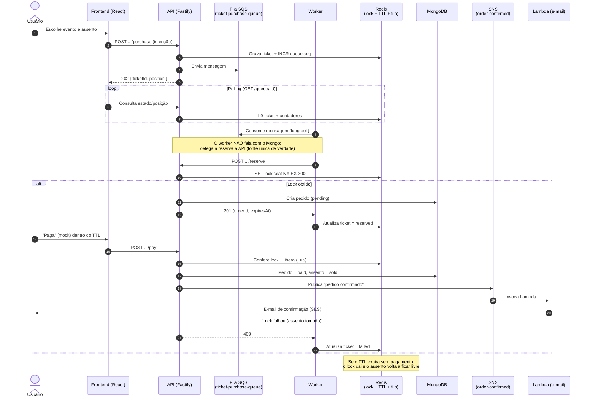
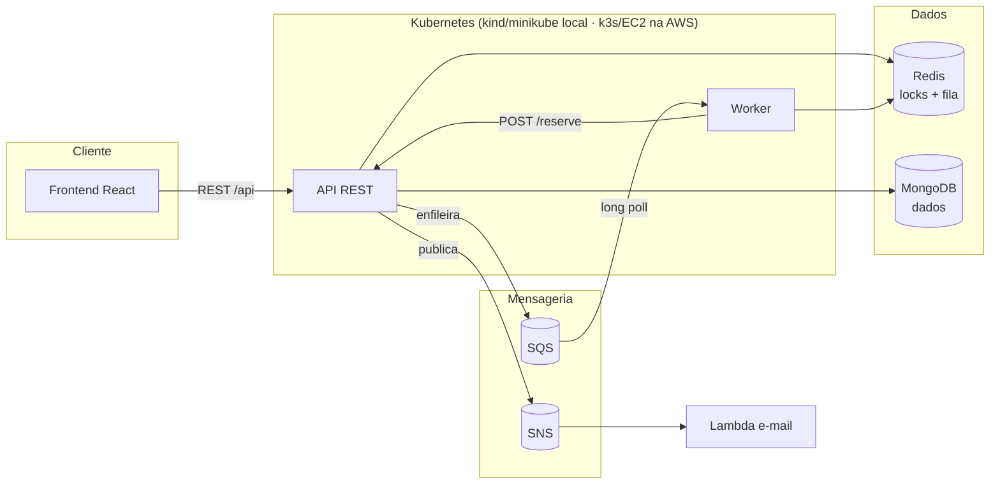
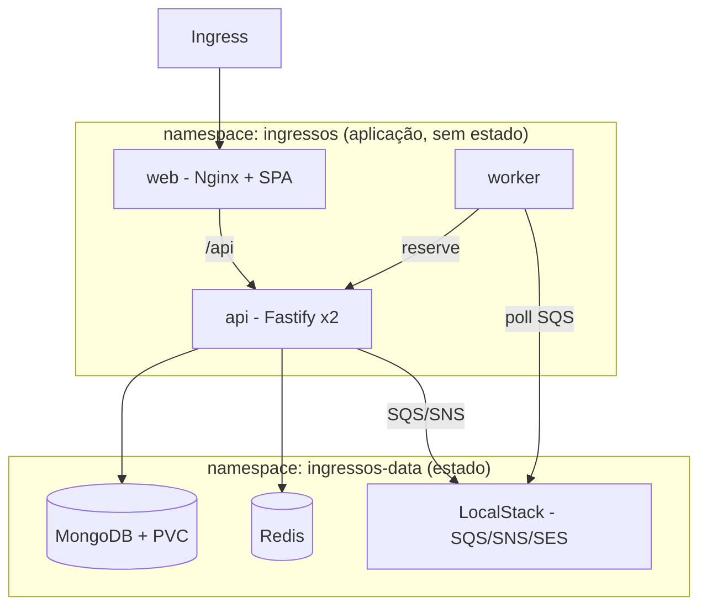
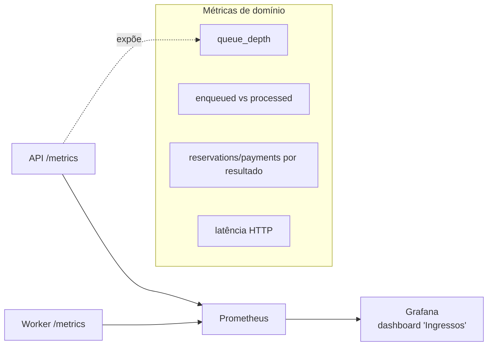
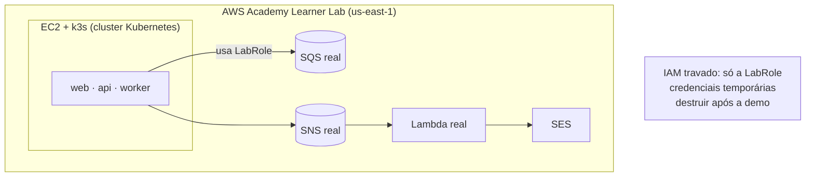

# Diagramas de Arquitetura

Diagramas em Mermaid (reaproveitáveis no artigo). Refletem o que foi de fato
implementado (ver `docs/decisoes.md`, ADR-000 a 008).

## Fluxo principal — caminho feliz da compra

## Visão de componentes (alto nível)

## Topologia no Kubernetes (Fase 5)

Isolamento por namespaces; entrada única pelo Ingress.

## Observabilidade (Fase 7)

## Implantação na AWS Academy (Fase 6 — planejada)

