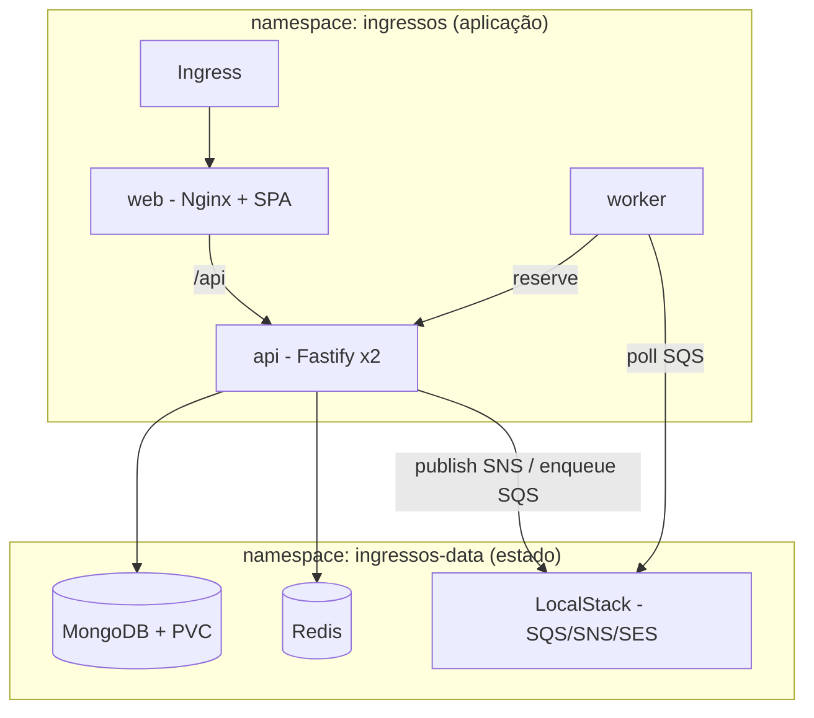

# Kubernetes — Fase 5 (containerização + orquestração)

Manifests que sobem a aplicação inteira em um cluster Kubernetes. **Os mesmos
arquivos servem para o cluster local (kind/minikube) e para o k3s sobre EC2 da
Fase 6** — só muda o contexto do `kubectl` e a forma de publicar as imagens.

## Topologia



- **Isolamento por namespaces:** `ingressos` (app, sem estado) e `ingressos-data`
  (Mongo, Redis, LocalStack). Comunicação por DNS interno (FQDN).
- **API com 2 réplicas** (sem estado, escala horizontal); **worker com 1 réplica**
  (o `WORKER_RATE_MS` define o ritmo agregado de consumo da fila).
- **Web** = build do Vite servido por Nginx, que faz proxy de `/api` para a API.

## Pré-requisitos
- Docker
- `kubectl`
- **kind** *ou* **minikube** (cluster local)

Criar o cluster (uma vez):
```bash
# kind
kind create cluster --name ingressos
# minikube
minikube start
```

## Subir tudo (script)
```powershell
# Windows
./scripts/k8s-local.ps1 kind        # ou: minikube
```
```bash
# Linux/macOS
./scripts/k8s-local.sh kind         # ou: minikube
```
O script **constrói as 3 imagens, carrega no cluster e aplica os manifests**.
(É necessário carregar as imagens no cluster porque elas são locais — não estão
num registry. Por isso os Deployments usam `imagePullPolicy: IfNotPresent`.)

## Subir tudo (manual)
```bash
# 1. build
docker build -t ingressos/api:latest    -f infra/docker/api.Dockerfile .
docker build -t ingressos/worker:latest -f infra/docker/worker.Dockerfile .
docker build -t ingressos/web:latest    -f infra/docker/web.prod.Dockerfile .

# 2. carregar no cluster (kind)
kind load docker-image ingressos/api:latest ingressos/worker:latest ingressos/web:latest --name ingressos
#    (minikube: minikube image load ingressos/api:latest ... )

# 3. aplicar
kubectl apply -k infra/k8s
```

## Acessar o frontend
Sem Ingress (mais simples):
```bash
kubectl -n ingressos port-forward svc/web 8088:80
# abrir http://localhost:8088
```
Com Ingress:
```bash
# kind: instalar o ingress-nginx
kubectl apply -f https://kind.sigs.k8s.io/examples/ingress/deploy-ingress-nginx.yaml
# minikube: minikube addons enable ingress
# adicionar ao hosts:  127.0.0.1 ingressos.local
# abrir http://ingressos.local
```

## Verificar
```bash
kubectl get pods -A | grep ingressos
kubectl -n ingressos logs deploy/worker -f      # ver o consumo da fila
```

## Limitações conhecidas (honestidade para o artigo)
- **Lambda de e-mail não executa neste modo.** O LocalStack roda Lambdas via
  socket do Docker, indisponível dentro do pod. Aqui habilitamos só `sqs,sns,ses`;
  o pagamento ainda **publica no SNS**, mas não há consumidor Lambda anexado.
  O fluxo `SNS → Lambda → SES` completo é demonstrado no `docker-compose`
  (Fase 3) e será **real** na AWS (Fase 6, AWS Academy Learner Lab).

## Reaproveitamento na Fase 6 (k3s/EC2 no AWS Academy)
- Os mesmos manifests rodam no k3s. Diferenças:
  - `kubectl` aponta para o k3s da EC2 (`KUBECONFIG`).
  - Imagens vão para o **Docker Hub** (ECR pode faltar no Learner Lab) ou via
    `docker save | ssh ... docker load`.
  - Ingress: o k3s já traz **Traefik** — trocar `ingressClassName: nginx` por
    `traefik` no `30-ingress.yaml`.
  - Para usar **AWS real** (SQS/SNS/Lambda gerenciados) em vez do LocalStack:
    esvaziar `AWS_ENDPOINT_URL` no ConfigMap (o SDK passa a usar a `LabRole`).
